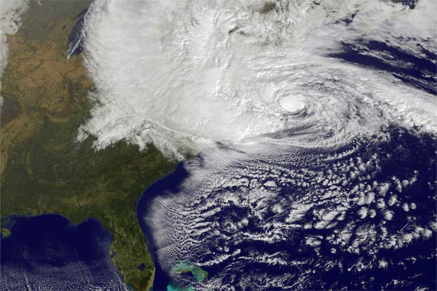

--- 
title: "Hurricane Analysis and Visualization Using R"
author: "Romane Goldmuntz, Vy Tran, and Jianqiong Zhan"
date: "`r Sys.Date()`"
site: bookdown::bookdown_site
output: bookdown::gitbook
documentclass: book
bibliography: [proj.bib, packages.bib]
biblio-style: apalike
link-citations: yes
github-repo: rstudio/bookdown-demo
description: "This is an edav class final project"
---


# Introduction {#intro}
<center>




</center>

Hurricanes have caused tremendous losses on the country’s economy (@Winkle2018): they currently cost the government over \$28 billion each year. Besides the government, several industries are heavily impacted by hurricanes, including the insurance industry. For example, according to Bloomberg, hurricane Dorian caused the insurance industry losses of up \$25 billion, making it the most expensive natural disaster for the industry since 2017’s Hurricane Maria (@DSouza2019). Therefore, the United States’ Sustainable Development has identified economic losses from hurricane as a key indicator for the economic growth (@SDG2018). Disentangling the relative roles of variability and changes in Hurricane could contribute information useful to sustainable development goals.


```{r echo=FALSE}
 knitr::opts_chunk$set(warning = FALSE, message = FALSE)
```

```{r eco-hurricane-fig, fig.cap='Cost of Damage by Six Most Recent Hurricanes', out.width='80%', fig.asp=.75, fig.align='center', echo=FALSE,fig.show =  'hide' }

library(rvest)
library(dplyr)
library(robotstxt)
library(ggplot2)
url <- "https://en.wikipedia.org/wiki/List_of_costliest_Atlantic_hurricanes"
#paths_allowed(url)

df<-as.data.frame(read_html(url) %>% html_table(fill = TRUE))

df_clean <- df %>% mutate(Nominal_Damage = as.factor(gsub("[$><]", "",Nominal.damage.Billions.USD.)))%>%
  dplyr::select(Name, Season, Storm.classificationat.peak.intensity,Nominal_Damage) %>% rename(Classification = Storm.classificationat.peak.intensity)
df_clean$Season<-as.factor(df_clean$Season)
as.numeric.factor <- function(x) {as.numeric(levels(x))[x]}
df_clean[4]<-lapply(df_clean[4],as.numeric.factor)
df_clean[2]<-lapply(df_clean[2],as.numeric.factor)
df_clean <- df_clean %>% arrange(desc(Season)) %>% top_n(6)
ggplot(df_clean,aes(x=Name, y= Nominal_Damage)) + geom_bar(position = "dodge", stat = "identity") + coord_flip() + xlab("Hurricane") + ylab("Damage (in Billion Dollars)") + ggtitle("Cost of Damage by Six Most Recent Hurricanes") + theme_classic()
```


Key frequently asked questions are: how climate affects hurricane, and what of the future hurricanes are more likely to be. To gain insight on these questions, we first have to look into historical records to discern the variability and changes of hurricanes, the analysis of which will help us to build predictive understanding of the influencing of climate on hurricane. Our working hypothesis is that: if greenhouse warming has caused a substantial increase in Atlantic hurricane activity, then the century scale increase in Atlantic hurricane since 1851 should have produced a long-term rise in measures of Atlantic hurricanes activity, similar to that seen for global temperature, for example. Therefore, we aim to dig into the original storm track file with more than 150 years of records of Atlantic tropical storm activities in order to examine variability and changes of Atlantic hurricane under global warming conditions. Specifically, three important questions we would like to address in this analysis are:

_(1)	What influences the change in category of hurricanes?_

_(2) Has hurricane activity shifted north-ward?_

_(3)	Have humans already caused a detectable increase in Atlantic hurricane activity?_

_(4)	What other embedding patterns can we learn from the historical Atlantic hurricane record? How does this will help us to build predictive understanding of the influencing of climate on hurricane?_


